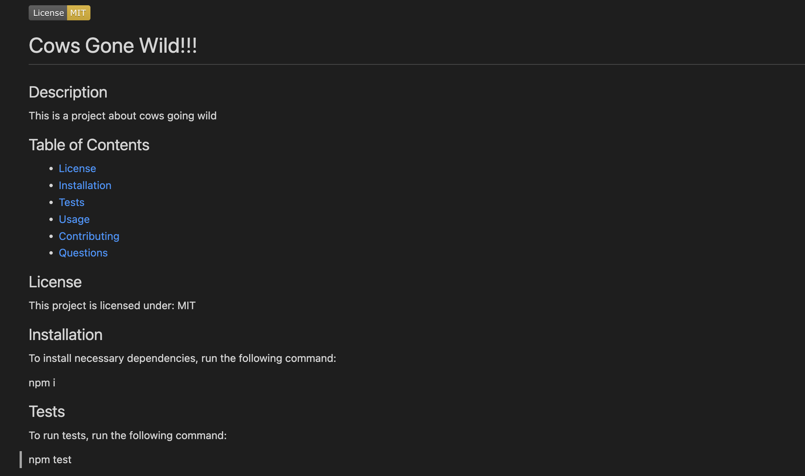

# README - Generator
[Video](https://watch.screencastify.com/v/np6KpwLUBuVxlnjkiTOR)

## About README - Generator
Generator that allows the user to create a README based on their inputs.



## Code Snippet
Below is a preview of some of the code used to create the array of questions

```
const questions = 
[
  {
    type: 'input',
    name: 'Github',
    message: "What is your Github username?"
},
{
  type: 'input',
  name: 'Email',
  message: "What is your email address?"
},
  {
    type: 'input',
    name: 'Project',
    message: 'What is the title of your project?',
  },
  {
    type: 'input',
    name: 'Description',
    message: 'Please write a description of your project',
  },  
  ```

## Author Links

[LinkedIn](https://www.linkedin.com/in/senayg/)
[Github](https://github.com/senaygebrat)

  